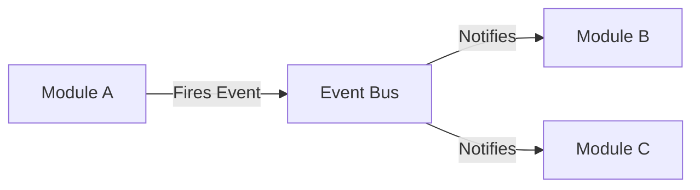
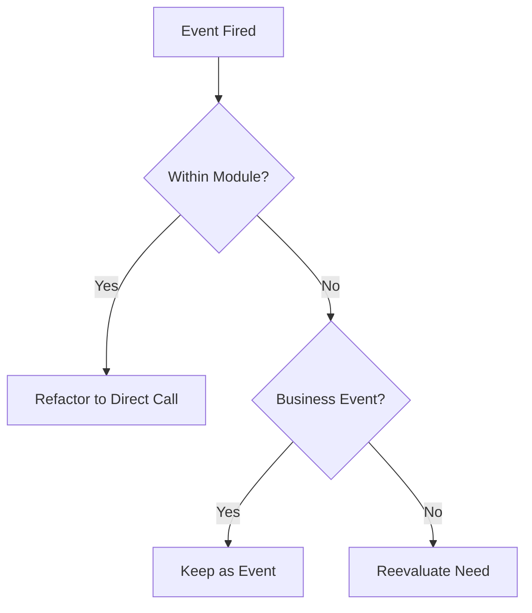

### **Principle: Event Listeners Involve Trade-offs**
Event Listeners are not inherently good or bad; their value depends on system context and requirements, balancing decoupling and flexibility against readability and complexity.

---
**Explanation:**
Using Event Listeners requires evaluating pros like **decoupling** and **flexibility** against cons such as reduced **readability** and increased **complexity**. In modern architectures like **Microservices** and **Event-Driven systems**, patterns such as **Event Sourcing**, **Event Bus**, and **Business Events** help manage events. As event volume grows, metrics like **code readability** and **module cohesion** may decline, while **decoupling dependencies** and **system flexibility** improve. Event Listeners are particularly valuable in **modular** or **microservice** systems where decoupling is crucial.

**Implementation Example:**
```javascript
// Firing an event for decoupling
eventBus.publish('order.completed', { orderId, timestamp: Date.now() });
```

### **Principle: Prohibit Intra-module Event Listeners**
Using Event Listeners within a single module is prohibited; they should only facilitate communication between separate modules.

---
**Explanation:**
Direct coupling within a module reduces independence and rigidity. Event-based inter-module communication promotes **loose coupling**. Event listeners should act as **orchestrators**, delegating business logic to service layers, avoiding complex conditionals, minimizing synchronous operations, and focusing on routing and coordination.

**Implementation Example:**


### **Principle: Prefer Event-Based Over Direct Coupling**
For inter-module communication, prefer firing events and listening rather than direct service calls or connections.

---
**Explanation:**
Direct connections between entities of two modules violate modularity. Directly calling services from another module causes tight coupling. Event-based approaches promote **loose coupling** and are recommended when decoupling is prioritized over direct coupling.

**Implementation Example:**
| Scenario | Status | Impact |
|----------|--------|--------|
| Direct connection between entities of two modules | ❌ Prohibited | Violates modularity |
| Directly calling a service from another module | ⚠️ Discouraged | Causes tight coupling |
| Firing an event from Module A and listening in Module B | ✅ Allowed | Promotes loose coupling |

### **Principle: Use Business Events for Meaningful Occurrences**
Fire Business Events to represent meaningful business occurrences, even if no current listeners exist, to future-proof architecture and enable loose coupling.

---
**Explanation:**
**Business Events** are events that signify important business happenings, useful for notifications, monitoring, auditing, logging, and triggering workflows. They make systems more **observable**, enable **loose coupling**, and support cross-cutting concerns.

**Implementation Example:**
```javascript
class OrderService {
  async completeOrder(orderId) {
    // Business logic...
    eventBus.publish('order.completed', { orderId, timestamp: Date.now() });
  }
}
```

### **Principle: Use Event Listeners for Asynchronous Inter-module Communication**
Use Event Listeners when communicating between independent modules, especially when multiple components need to react or when decoupling is more important than direct coupling.

---
**Explanation:**
Event Listeners are suitable for scenarios requiring communication between independent modules, multiple reactions to an event, or prioritizing decoupling. Avoid them for intra-module communication, when direct coupling is simpler, or for synchronous needs.

**Implementation Example:**
<div className="alert alert--success">
  <strong>✅ Use When:</strong>
  <ul>
    <li>Communicating between independent modules</li>
    <li>Decoupling is more important than direct coupling</li>
    <li>Multiple components need to react to an event</li>
  </ul>
</div>

### **Principle: Refactor Intra-module Events and Document Business Events**
Refactor any intra-module event listeners to direct calls, keep inter-module event-based communication, and document all business events and their purposes.

---
**Explanation:**
Maintain separation of concerns by refactoring intra-module events. Preserve inter-module events for flexibility. Documenting business events ensures clarity and future usability, even without current listeners.

**Implementation Example:**

